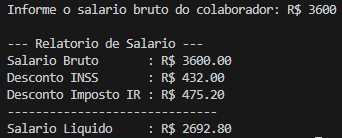

# 💰 Calculadora de Salário Líquido em C

Este é um projeto simples, desenvolvido em linguagem C, para calcular o salário líquido de um colaborador, aplicando as deduções do Imposto de Renda (IR) e do INSS com base nas tabelas de contribuição vigentes.

## 📝 Regras de Negócio

O programa segue as seguintes regras de cálculo, baseadas nas tabelas de descontos:

### Tabela 1: Descontos INSS
| Salário de Contribuição (R$)     | Alíquota |
|----------------------------------|----------|
| Até R$ 1.320,00                  | 7,5%     |
| De R$ 1.320,01 até R$ 2.571,29   | 9%       |
| De R$ 2.571,30 até R$ 3.856,94   | 12%      |
| De R$ 3.856,95 a R$ 7.507,49     | 14%      |

### Tabela 2: Descontos Imposto de Renda
| Salário de Contribuição (R$)     | Alíquota |
|----------------------------------|----------|
| Até R$ 1.903,98                  | -        |
| De R$ 1.903,99 até R$ 2.826,65   | 7,5%     |
| De R$ 2.826,66 até R$ 3.751,05   | 15,0%    |
| De R$ 3.751,06 até R$ 4.664,68   | 22,5%    |
| Acima de R$ 4.664,68             | 27,5%    |

## 🚀 Como Compilar e Executar

Para rodar este projeto, você precisa ter um compilador C instalado (como o GCC).

1.  **Clone o repositório:**
    ```bash
    git clone [https://github.com/JamPassos/Sal-rio-l-quido-.git](https://github.com/JamPassos/Sal-rio-l-quido-.git)
    cd calculadora-salario-c
    ```

2.  **Compile o código:**
    ```bash
    gcc salario.c -o salario
    ```

3.  **Execute o programa:**
    ```bash
    ./salario
    ```

## 🖥️ Exemplo de Saída

Ao executar o programa, você será solicitado a informar o salário bruto. A saída será algo semelhante a:
